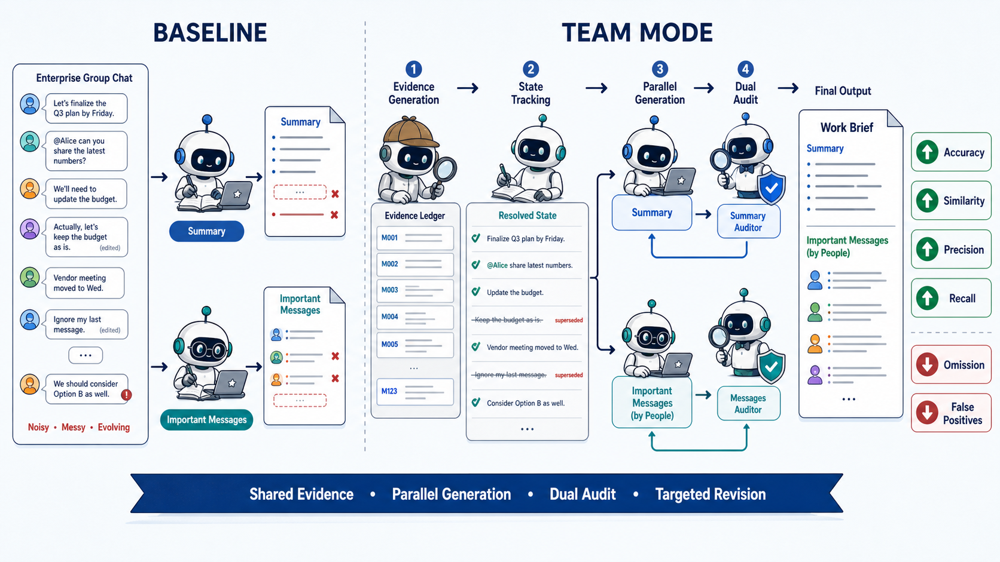

# IM-Summary: State-Aware Summarization and Evidence Extraction for Workplace Group Chats

IM-Summary 同时完成两项互补任务：生成结构化工作简报，以及从原始群聊中抽取可追溯的重要消息。项目提供可公平比较的基础模式与团队模式，目标是验证共享证据、状态消歧和任务专属审核对摘要质量及重要消息精确率/召回率的贡献。



## 阿里阿德涅之线：从复杂讨论中追溯事实

在希腊神话中，阿里阿德涅交给忒修斯一个线团，使他即使深入迷宫，也能沿着自己留下的轨迹找到出口。

工作群聊同样像一座不断扩展的迷宫：议题彼此交叉，提议可能被否决，结论会被修订，负责人和截止时间也会不断变化。**所有消息都被保留下来，但并非所有消息仍然代表当前事实。**

**基础模式**将摘要生成和重要消息抽取视为两个相互独立的任务。两个模型分别读取同一份原始群聊，并行生成结果，不共享中间事实，也不经过额外审核，由此构成直接生成的朴素对照组。

**团队模式**则先建立一份共享且可追溯的事实基础，再完成两个下游任务：

1. **事件识别**：从交叉讨论中整理与决策、任务、问题和进展相关的事件，并关联对应的原始消息。
2. **状态判断**：区分 `proposed`、`confirmed`、`superseded` 等状态，识别哪些信息仍然有效、哪些已经被后续讨论取代。
3. **共享证据账本**：统一组织当前有效事件、状态及其来源消息，形成两个任务共同使用的事实层。
4. **并行生成**：摘要撰稿人生成结构化工作简报，消息分析员抽取可追溯的重要原始消息。
5. **独立审核与定向修订**：两名审校员分别检查摘要和重要消息；发现问题时，只退回对应分支修订，而不重新执行整条流程。

```text
原始群聊
   ↓
事件识别 → 状态判断 → 共享证据账本
                         ├─→ 摘要生成 → 摘要审核
                         └─→ 重要消息 → 消息审核
```

团队模式的核心并不是让更多 Agent 重复阅读同一段对话，而是让两个任务首先基于**同一份经过状态消歧的事实**开展工作，同时保留各自独立的生成目标、评价标准与审核闭环。

> **我们不仅希望知道最终发生了什么，也希望保留一条能够从结论返回原始证据的“线”。**

## 两种模式

| 维度 | 基础模式 | 团队模式 |
| :--- | :--- | :--- |
| 输入 | 两个模型各自读取原始群聊 | 先构建共享证据账本 |
| 生成 | 摘要与重要消息并行直出 | 两个任务基于同一有效事件并行生成 |
| 状态处理 | 依赖单次提示词理解 | 显式区分 proposed、confirmed、superseded 等状态 |
| 质量控制 | 无审核和修订 | 两个独立审核器，按任务定向返工 |
| 可解释性 | 最终结果 | 事件、证据消息 ID、审核问题和修订记录 |
| 实验角色 | baseline | proposed agent workflow |

两种模式共用“重要消息”模型配置与相同原始输入，避免用更强的抽取模型制造不公平提升。团队模式的预期收益来自证据组织和审核闭环，实际提升以同一数据集上的六项指标为准。

## 输出与评测

生成结果统一渲染为工作群聊分析简报。“重要消息”位于整份 Markdown 的末尾，按原消息说话人本名分组。每条只保留消息 ID、说话人本名、原文和重要原因，不再使用类型、优先级或受影响人字段。页面和导出结果不显示装饰性表情，也不包含账户个人或个人关注项。

评测页在同一行展示六项指标，并在下方保留可筛选、可导出的历史表格：

| 摘要任务 | 重要消息任务 |
| :--- | :--- |
| 摘要准确率、关键信息遗漏率、文本相似度、LLM 文本评分 | 重要消息精确率、重要消息召回率 |

`llm_score` 只评价摘要主体；重要消息没有黄金标注时，精确率和召回率显示“暂无标注”，不会用摘要分数代替。

评测开始后，指标区以低干扰的呼吸点和细进度线提示运行状态。文本相似度与重要消息精确率/召回率在本地确定性计算，只有摘要准确率、遗漏率和文本评分需要调用一次评审模型；相同摘要与黄金版本的重复请求会直接复用已有结果。

六张指标卡始终保持可见：当前摘要已有评测时展示对应分数，尚未评测时使用“—”占位并提供“开始评测”，不会用其他摘要版本的历史分数替代当前结果。

最新导入 JSON 契约与逐字段说明见 [导入会话数据字段说明 V2](docs/data-spec/导入会话数据字段说明_V2.md)。

## 技术栈

- 前端：Electron、React 18、TypeScript、Vite
- 后端：Java 17、Spring Boot 3.3、Spring Data JPA、H2
- 模型接入：OpenAI-compatible Chat Completions API
- 通信：REST、WebSocket 进度事件

## 快速启动

启动后端：

```powershell
cd backend
mvn spring-boot:run
```

启动桌面端：

```powershell
cd frontend
npm install
npm run dev
```

在设置中添加模型 API 配置并完成模型绑定；随后从左侧导入 JSON 样例，选择基础模式或团队模式运行。前端不内置 mock 数据，后端未连接时不会展示伪造会话或评测结果。

## 验证

```powershell
cd backend
mvn test

cd ..\frontend
npm run typecheck
npm run build
```

## 文档

- [后端设计](docs/design/后端设计文档_V5_最终版.md)
- [前端设计](docs/design/前端设计文档_V4_最终版.md)
- [Prompt 设计总纲](docs/prompt-strategy/00_Prompt设计总纲.md)
- [Few-shot 示例](docs/prompt-strategy/01_Few-shot示例集.md)
- [基础模式 Prompt](docs/prompt-strategy/02_单模型模式Prompt.md)
- [Markdown 渲染规范](docs/prompt-strategy/03_Markdown渲染规范.md)
- [评测方案](docs/evaluation/01_评测方案.md)
